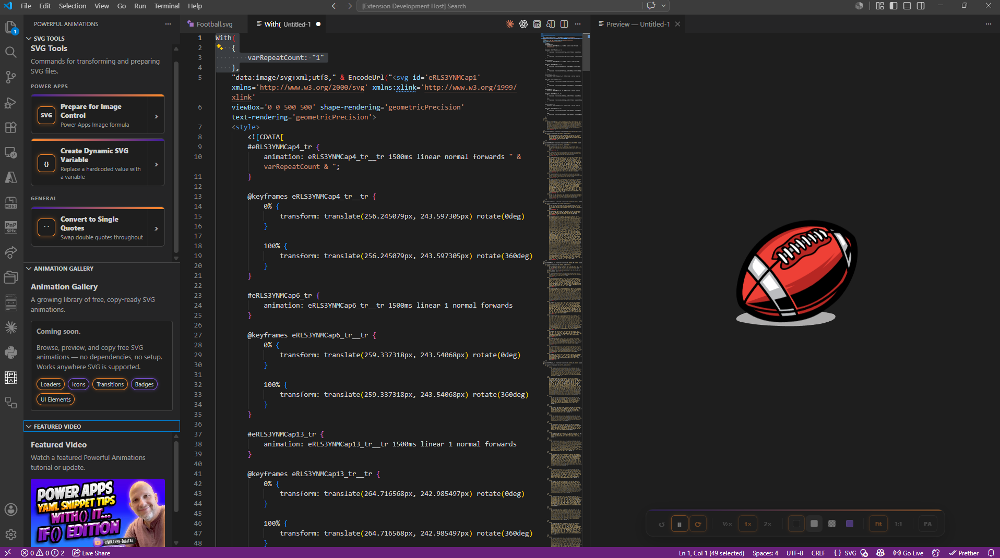
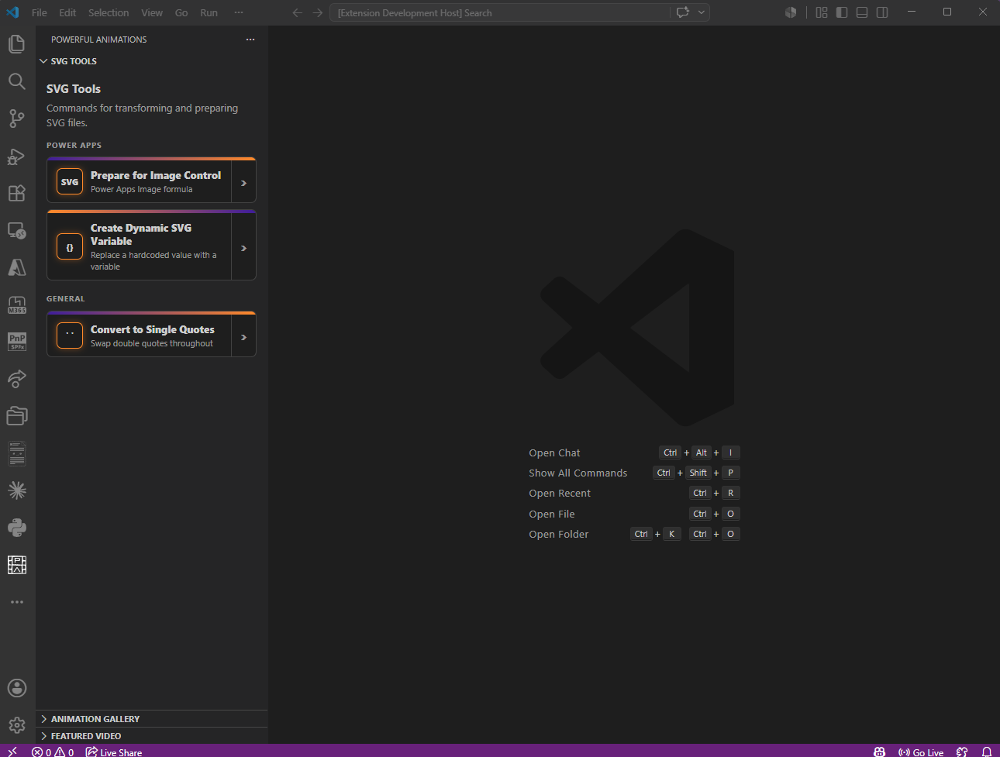
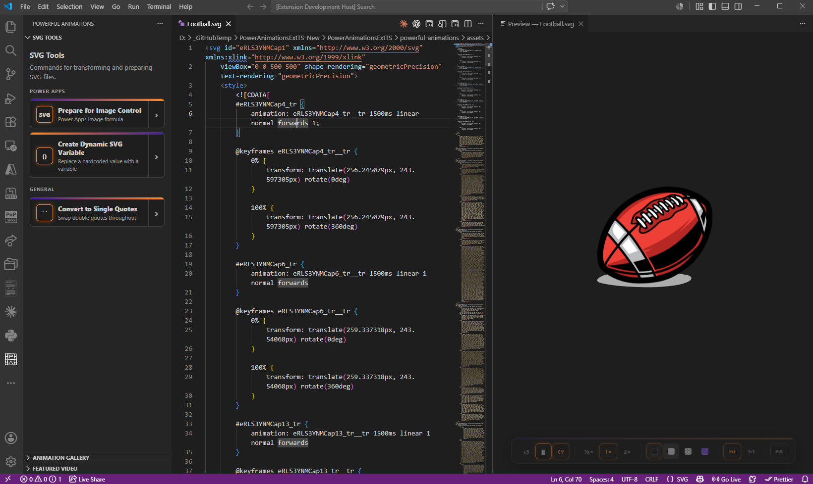
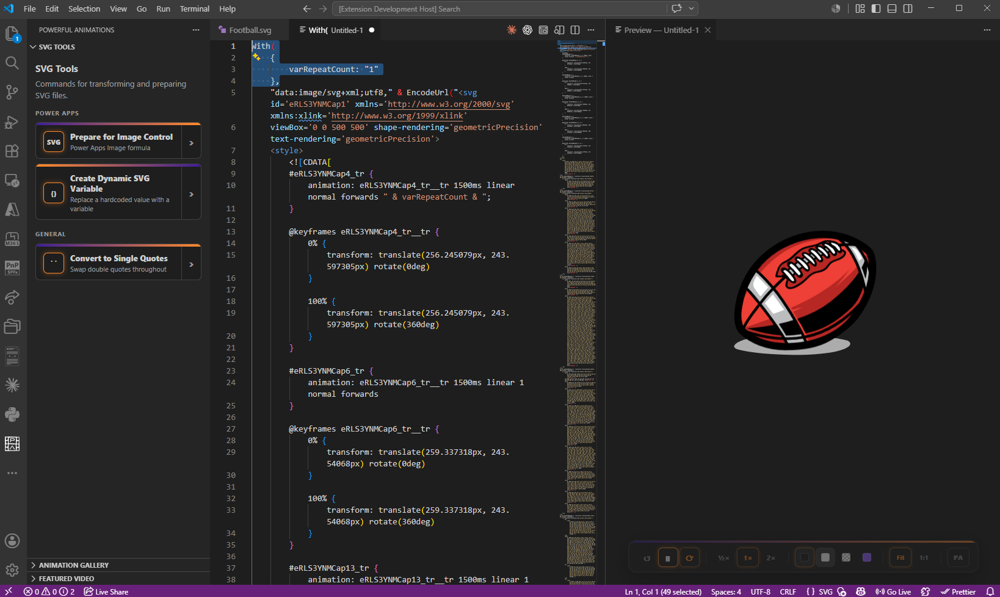

# Powerful Animations

**The SVG animation toolkit for VS Code — built for the Microsoft 365 and Power Platform community.**

[Install on VS Code Marketplace][marketplace] · [Report a Bug][new-bug] · [Request a Feature][new-feature]

---

---

This is the community and feedback hub for **Powerful Animations**. The extension source code is not hosted here.

Found a bug? Have a feature idea? Open an issue. All feedback is welcome.

---

## What is Powerful Animations?

Powerful Animations is a VS Code extension for working with SVG — especially if you build for Power Apps or anywhere else SVG is used across Microsoft 365.

- **Preview SVGs live** as you edit, with playback controls for animated SVGs
- **Prepare SVGs for Power Apps** — convert SVG markup into Image control formulas in one click
- **Build dynamic SVGs** — select a hardcoded value, name a Power Fx variable, and the extension wires it up
- **Generate `With()` formulas** — self-contained formulas with defaults baked in, ready to paste

[See the full feature list and documentation on the VS Code Marketplace →][marketplace]

---

## Install

Search **Powerful Animations** in the VS Code Extensions panel, or click below.

[![Install from VS Code Marketplace][marketplace-badge]][marketplace]

---

## Reporting a Bug

1. Check [Known Issues](docs/known-issues.md) first
2. Search [open issues][issues] to see if it has already been reported
3. Open a new issue using the [Bug Report][new-bug] template

Please include your VS Code version, OS, and a clear description of what you expected versus what happened. A short reproduction steps list is the single most helpful thing you can include.

---

## Requesting a Feature

Open an issue using the [Feature Request][new-feature] template. Describe what you are trying to do and why — context helps a lot more than just a feature name.

---

## Changelog

See [CHANGELOG.md](CHANGELOG.md) for what has changed in each release.

---

## Documentation

- [Getting Started](docs/getting-started.md)
- [FAQ](docs/faq.md)
- [Known Issues](docs/known-issues.md)

---

## Links

- [VS Code Marketplace][marketplace]
- [Warner Digital](https://warner.digital)

---

## License

MIT. The extension is free to use. See [LICENSE](LICENSE) for details.

<!-- Replace these before publishing the repo -->
[marketplace]: https://marketplace.visualstudio.com/items?itemName=WarnerDigital.powerful-animations
[marketplace-badge]: https://img.shields.io/visual-studio-marketplace/v/WarnerDigital.powerful-animations?label=VS%20Code%20Marketplace&logo=visualstudiocode
[issues]: https://github.com/PopWarner/powerful-animations-vscode/issues
[new-bug]: https://github.com/PopWarner/powerful-animations-vscode/issues/new?template=bug_report.md
[new-feature]: https://github.com/PopWarner/powerful-animations-vscode/issues/new?template=feature_request.md
